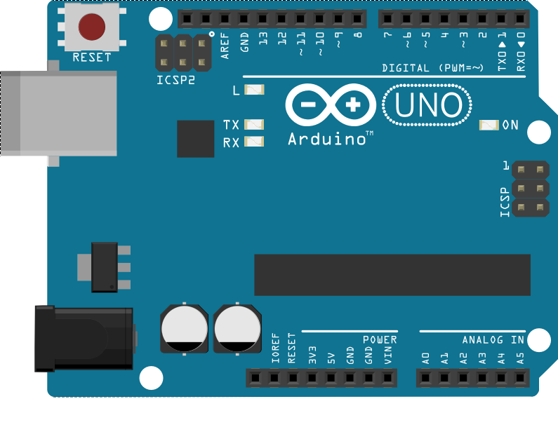
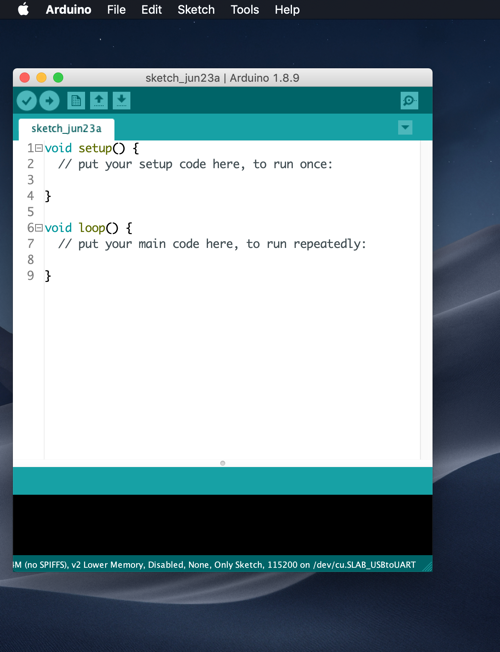
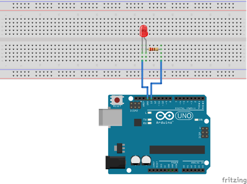

<h1>Arduno-UNO</h1>
<h3>Arduino UNO R3 บอร์ดทดลอง </h3>

Arduino เป็นไมโครคอนโทรลเลอร์ที่นำไปใช้อย่างแพร่หลายในปัจจุบัน สามารถเรียนรู้ได้รวดเร็ว จึงเหมาะสำหรับการนำไปสร้างโปรเจ็กต์ ต่างๆ ไมโครคอนโทรลเลอร์ Arduino ทุกรุ่น จะใช้ชิป AVR เป็นหลัก เพราะมีความทันสมัย ไมโครคอนโทรลเลอร์ Arduino สามารถโปรแกรมผ่านพอร์ตอนุกรมชนิต UART ได้ จึงทำให้เขียนโปรแกรมลงไปในชิป โดยการใช้การเชื่อม USB ติดต่อกับ UART
เราสามารถใช้ โปรแกรม Arduino IDE ในการเขียนโปรแกรม และ Upload โปรแกรมลงBoard Arduinoได้ โดยการเชื่อมต่อผ่านสายUSB เท่านี้เราก็จะได้สนุกกับความาสารของ Board Arduino กันแล้ว

1. ติดตั้ง โปรแกรม Arduino IDE Download ได้ที่  <a href="https://www.arduino.cc/en/Main/Software" target="_blank">Click</a>  
2. ติดตั้ง Driver USB CH340 Download ได้ที่ <a href="https://sparks.gogo.co.nz/ch340.html" target="_blank">Click</a>

รูปร่างบอร์ด

แสดงขาต่างของบอร์ด

<h3>Arduino Uno เป็นบอร์ดไมโครคอนโทรลเลอร์ที่ทำงานบนพื้นฐานของ ATmega 328 ซึ่งประกอบด้วย</h3>
<ul>
<li>14 digital input/output pins ( 6 pin สามารถใช้เป็น PWM output ได้ )</li>
<li>6 analog inputs</li>
<li>16 MHz ceramic resonator ( ใช้สำหรับกรองความถี่ให้กับบอร์ดไมโครคอนโทรลเลอร์ )</li>
<li>USB connection</li>
<li> ICSP header (In-Circuit Serial Programming)</li>
<li>ปุ่มกด reset</li>
<li>ช่องเสียบแหล่งจ่าย</li>  
</ul>

Arduino Uno Revision 2 มี ATmega8U2 ทำให้อัพเดท firmware ผ่าน USB protocal ที่เรียกว่า DFU( Device Firmware Update ) ได้ง่ายขึ้น 
 Arduino Uno สามารถเชื่อมต่อโดย USB connector หรือ จาก power supply จากภายนอกได้ โดยแหล่งพลังงานจะถูกเลือกโดยอัตโนมัติ 

<table>
<tr>
<td>Microcontroller</td>
<td>ATmega328P</td>
</tr>
<tr>
<td>Operating Voltage</td>
<td>5V</td>
</tr>
<tr>  
<td>Input Voltage (recommended)</td>
<td>7-12V</td>
</tr>
<tr>
<td>Input Voltage (limit)</td> 
<td>6-20V</td>
</tr>
<tr>
<td>Digital I/O Pins</td> 
<td>14 (of which 6 provide PWM output)</td>
</tr>
<tr>
<td>PWM Digital I/O Pins</td>
<td>6</td>
</tr>
<tr>   
<td>Analog Input Pins</td>  
<td>6</td>
</tr>
<tr>
<td>DC Current per I/O Pin</td>  
<td>20 mA</td>
</tr>
<tr>
<td>DC Current for 3.3V Pin</td>
<td>50 mA</td>
</tr>
<tr>
<td>Flash Memory</td> 
<td>32 KB (ATmega328P) of which 0.5 KB used by bootloader</td>
</tr>
<tr> 
<td>SRAM</td> 
<td>2 KB (ATmega328P)</td>
</tr>
<tr>
<td>EEPROM</td>
<td>1 KB (ATmega328P)</td>
</tr>
<tr>
<td>Clock Speed</td>  
<td>16 MHz</td>
</tr>
<tr>
<td>LED_BUILTIN</td>
<td>13</td>
</tr>
<tr>
<td>Length</td>
<td>68.6 mm</td>
</tr>
<tr>
<td>Width</td>
<td>53.4 mm</td>
</tr>
<tr>
<td>Weight</td>
<td>25 g</td>
</tr>
</table>	

<h3>การใช้งาน</h3>
Arduino UNO R3 จะมีขา Digital input/output อยู่ 14 ขา คือขา 0 ถึง 13 
หมายความว่า สามารถกำหนดให้เป็นขาที่เป็น input หรือ output ก็ได้
ขา Digital ก็ยังรับค่าที่เป็น Analog ได้ ซึ่งจะสามารถรับค่า Analog ค่าตั้งแต่ 0 - 1023
จะไม่สามารถส่งค่า Analog ออกไปได้
ส่วนขา Analog input/uotput อยู่ 6 ขา คือขา A0 ถึง A5
การใช้งานคล้ายกับขา Digital จะมีข้อแตกต่างเล็กน้อย คือ สามารถส่งค่า Analog ออกไปได้

<h3>การเขียนโปรแกรม Arduino ด้วย Arduino IDE</h3>
หลังจากเราติดตั้งโปรแกรมเป็นที่เรียบร้อย ให้เราเปิดโปรแกรมขึ้นมา
Arduino IDE จะ New Project ใหม่มาให้
พร้อมกับ Function เพื้นฐานที่ต้องมีในการเขียนโปรแกรม มา 2 Function
ได้แก่ setup กับ loop
ตามรูป

<h3>ตัวอย่าง Code ไฟกระพริบ</h3>
อุปกรณ์ที่ใช้ 
<ul>
 <li>Board NodeMCU V2</li>
 <li>บอร์ดทดลอง</li>
 <li>หลดด LED 5mm 1 ดวง</li>
 <li>สายจั๊ม</li>
</ul>

ต่อวงจรตามรูป

การเขียนโปรแกรมแบ่งออกเป็น 2 ส่วน  
คือการ setup จะเป็นการกำหนดค่า เริ่มต้นที่ function setup 
 1. เราจะสร้างตัวแปร led กำหนดค่า ที่ขา 13 ของบอร์ด  
 2. ใน function setup กำหนด led ให้ทำงาน โมด OUTPUT  
 โปรแกรมจะทำงานครั้งแรกครั้งเดียว 
 
ขั้นตอนที่ 2 กำหนดการทำงานของโปรแกรม 
 1. digitalWrite(led, HIGH);   สั่งให้ led เป็น HIGH (เป็น HIGH, 1 ก็ได้) หลอด LED จะติด 
 2. delay(1000); หยุดการทำงาน 1วินาที 
 3. digitalWrite(led, LOW);   สั่งให้ led เป็น LOW (เป็น LOW, 0 ก็ได้) หลอด LED จะดับ 
 4. delay(1000); หยุดการทำงาน 1วินาที 
 โปรแกรมจะกลับไปวนโลปใหม่ ทไให้ เราจะเห็น หลอด LED ติด 1 วินาที ดับ 1 วินาที 
 
พิมพ์ Code ตามด้านล่าง

    int led = 13;  // เราสร้างตัวแปรมากำหนดค่า ที่ขา 13 ของบอร์ด
    void setup() {                
      pinMode(led, OUTPUT);  // กำหนด  led ให้ทำงาน โมด OUTPUT   
    }

    void loop() {
      digitalWrite(led, HIGH);  
      delay(1000);              
      digitalWrite(led, LOW);  
      delay(1000);              
    }

ขอบคุณ  www.bq.com
ขอบคุณ  http://fritzing.org/home/
